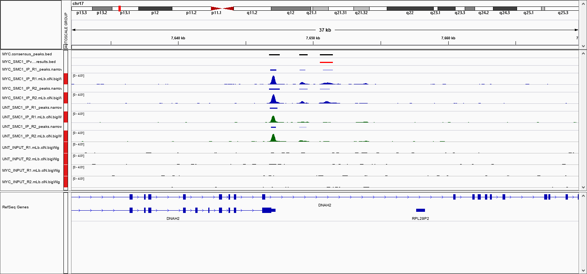

```{r setup, include=FALSE, message=FALSE}
knitr::opts_chunk$set(echo = TRUE)
library(DT)
library(yaml)
```

# 

This document describes the output produced by the pipeline. Most of the plots are taken from the [MultiQC report]("multiqc/multiqc_report.html"), which summaries results at the end of the pipeline.

## Experiment design

```{r, results = 'asis', echo=FALSE}
data <- yaml::yaml.load_file(params$summary)
cat(data$data, sep = "\n")
```

### Design table
```{r}
data <- read.csv(params$design)
datatable(data)
```

## Pipeline overview
The pipeline is built using [Nextflow](https://www.nextflow.io/)
and processes data using the following steps:

* [FastQC](#fastqc) - read quality control
* [TrimGalore](#trimgalore) - adapter trimming
* [STAR](#star) - alignment
* [featureCounts](#featurecounts) - gene counts, biotype counts, rRNA estimation.
* [Salmon](#salmon) - gene counts, transcripts counts.
* [StringTie](#stringtie) - FPKMs for genes and transcripts
* [Sample_correlation](#Sample_correlation) - create MDS plot and sample pairwise distance heatmap / dendrogram
* [MultiQC](#multiqc) - aggregate report, describing results of the whole pipeline
* [DEseq2](#deseq2) - differential analysis

## FastQC
[FastQC](http://www.bioinformatics.babraham.ac.uk/projects/fastqc/) gives general quality metrics about your reads. It provides information about the quality score distribution across your reads, the per base sequence content (%T/A/G/C). You get information about adapter contamination and other overrepresented sequences.

, "multiqc_plots/png/mqc_fastqc_per_base_sequence_quality_plot_1.png", "https://www.bioinformatics.babraham.ac.uk/projects/fastqc/fastqc.png")`)

For further reading and documentation see the [FastQC help](http://www.bioinformatics.babraham.ac.uk/projects/fastqc/Help/).

> **NB:** The FastQC plots displayed in the MultiQC report shows _untrimmed_ reads. They may contain adapter sequence and potentially regions with low quality. To see how your reads look after trimming, look at the FastQC reports in the `trim_galore` directory.

**Output directory: `results/fastqc`**

* `sample_fastqc.html`
  * FastQC report, containing quality metrics for your untrimmed raw fastq files
* `zips/sample_fastqc.zip`
  * zip file containing the FastQC report, tab-delimited data file and plot images

## TrimGalore
The nfcore/rnaseq pipeline uses [TrimGalore](http://www.bioinformatics.babraham.ac.uk/projects/trim_galore/) for removal of adapter contamination and trimming of low quality regions. TrimGalore uses [Cutadapt](https://github.com/marcelm/cutadapt) for adapter trimming and runs FastQC after it finishes.

MultiQC reports the percentage of bases removed by TrimGalore in the _General Statistics_ table, along with a line plot showing where reads were trimmed.

**Output directory: `results/trim_galore`**

Contains FastQ files with quality and adapter trimmed reads for each sample, along with a log file describing the trimming.

* `sample_val_1.fq.gz`, `sample_val_2.fq.gz`
  * Trimmed FastQ data, reads 1 and 2.
  * NB: Only saved if `--saveTrimmed` has been specified.
* `logs/sample_val_1.fq.gz_trimming_report.txt`
  * Trimming report (describes which parameters that were used)
* `FastQC/sample_val_1_fastqc.zip`
  * FastQC report for trimmed reads

Single-end data will have slightly different file names and only one FastQ file per sample.

## STAR
STAR is a read aligner designed for RNA sequencing.  STAR stands for Spliced Transcripts Alignment to a Reference, it produces results comparable to TopHat (the aligned previously used by NGI for RNA alignments) but is much faster.

The STAR section of the MultiQC report shows a bar plot with alignment rates: good samples should have most reads as _Uniquely mapped_ and few _Unmapped_ reads.

, "multiqc_plots/png/mqc_star_alignment_plot_1.png", "images/star_alignment_plot.png")`)

**Output directory: `results/STAR`**

* `Sample_Aligned.sortedByCoord.out.bam`
  * The aligned BAM file
* `Sample_Log.final.out`
  * The STAR alignment report, contains mapping results summary
* `Sample_Log.out` and `Sample_Log.progress.out`
  * STAR log files, containing a lot of detailed information about the run. Typically only useful for debugging purposes.
* `Sample_SJ.out.tab`
  * Filtered splice junctions detected in the mapping
* `unaligned/...`
  * Contains the unmapped reads that couldn't be mapped against the reference genome chosen. 


## featureCounts
[featureCounts](http://bioinf.wehi.edu.au/featureCounts/) from the subread package summarises the read distribution over genomic features such as genes, exons, promotors, gene bodies, genomic bins and chromosomal locations.
RNA reads should mostly overlap genes, so be assigned.

, "multiqc_plots/png/mqc_featureCounts_assignment_plot_1.png", "images/featureCounts_assignment_plot.png")`)

We also use featureCounts to count overlaps with different classes of features. This gives a good idea of where aligned reads are ending up and can show potential problems such as rRNA contamination.
, "multiqc_plots/png/mqc_featureCounts_biotype_plot_1.png", "images/featureCounts_biotype_plot.png")`)

**Output directory: `results/featureCounts`**

* `Sample.bam_biotype_counts.txt`
  * Read counts for the different gene biotypes that featureCounts distinguishes.
* `Sample.featureCounts.txt`
  * Read the counts for each gene provided in the reference `gtf` file
* `Sample.featureCounts.txt.summary`
  * Summary file, containing statistics about the counts

## Salmon
[Salmon](https://salmon.readthedocs.io/en/latest/salmon.html) from [Ocean Genomics](https://oceangenomics.com/) quasi-maps and quantifies expression relative to the transcriptome.

**Output directory: `results/salmon`**

* `Sample/quant.sf`
  * Read counts for the different transcripts.
* `Sample/quant.genes.sf`
  * Read the counts for each gene provided in the reference `gtf` file
* `Sample/logs`
  * Summary file with information about the process
* `unaligned/`
  * Contains a list of unmapped reads that can be used to generate a FastQ of unmapped reads for downstream analysis.

### tximport
[tximport](https://bioconductor.org/packages/release/bioc/html/tximport.html) imports transcript-level abundance, estimated counts and transcript lengths, and summarizes into matrices for use with downstream gene-level analysis packages. Average transcript length, weighted by sample-specific transcript abundance estimates, is provided as a matrix which can be used as an offset for different expression of gene-level counts.

**Output directory: `results/salmon`**

* `salmon_merged_transcript_tpm.csv`
  * TPM counts for the different transcripts.
* `salmon_merged_gene_tpm.csv`
  * TPM counts for the different genes.
* `salmon_merged_transcript_counts.csv`
  * estimated counts for the different transcripts.
* `salmon_merged_gene_counts.csv`
  * estimated counts for the different genes.
* `tx2gene.csv`
  * CSV file with transcript and genes (`params.fc_group_features`) and extra name (`params.fc_extra_attributes`) in each column.
* `se.rds`
  * RDS object to be loaded in R that contains a [SummarizedExperiment](https://bioconductor.org/packages/release/bioc/html/SummarizedExperiment.html) with the TPM (`abundance`), estimated counts (`counts`) and transcript length (`length`) in the assays slot for transcripts.
* `gse.rds`
  * RDS object to be loaded in R that contains a [SummarizedExperiment](https://bioconductor.org/packages/release/bioc/html/SummarizedExperiment.html) with the TPM (`abundance`), estimated counts (`counts`) and transcript length (`length`) in the assays slot for genes.


### Index files

**Output directory: `results/reference_genome/salmon_index`**

* `duplicate_clusters.tsv`
  * Stores which transcripts are duplicates of one another
* `hash.bin`
* `header.json`
  * Information about k-mer size, uniquely identifying hashes for the reference
* `indexing.log`
  * Time log for creating transcriptome index
* `quasi_index.log`
  * Step-by-step log for making transcriptome index
* `refInfo.json`
  * Information about file used for the reference
* `rsd.bin`
* `sa.bin`
* `txpInfo.bin`
* `versionInfo.json`
  * Salmon and indexing version sed to make the index

### Quantification output

**Output directory: `results/salmon`**

* `aux_info/`
  * Auxiliary info e.g. versions and number of mapped reads
* `cmd_info.json`
  * Information about the Salmon quantification command, version, and options
* `lib_format_counts.json`
  * Number of fragments assigned, unassigned and incompatible
* `libParams/`
  * Contains the file `flenDist.txt` for the fragment length distribution
* `logs/`
  * Contains the file `salmon_quant.log` giving a record of Salmon's quantification
* `quant.sf`
  * *Transcript*-level quantification of the sample, including gene length, effective length, TPM, and number of reads
* `quant.genes.sf`
  * *Gene*-level quantification of the sample, including gene length, effective length, TPM, and number of reads
* `Sample.transcript.tpm.txt`
  * Subset of `quant.sf`, only containing the transcript id and TPM values
* `Sample.gene.tpm.txt`
  * Subset of `quant.genes.sf`, only containing the gene id and TPM values

## StringTie
[StringTie](https://ccb.jhu.edu/software/stringtie/) assembles RNA-Seq alignments into potential transcripts. It assembles and quantitates full-length transcripts representing multiple splice variants for each gene locus.

StringTie outputs FPKM metrics for genes and transcripts as well as the transcript features that it generates.

**Output directory: `results/stringtie`**

* `<sample>_Aligned.sortedByCoord.out.bam.gene_abund.txt`
  * Gene aboundances, FPKM values
* `<sample>_Aligned.sortedByCoord.out.bam_transcripts.gtf`
  * This `.gtf` file contains all of the assembled transcipts from StringTie
* `<sample>_Aligned.sortedByCoord.out.bam.cov_refs.gtf`
  * This `.gtf` file contains the transcripts that are fully covered by reads.

## Sample Correlation
[edgeR](https://bioconductor.org/packages/release/bioc/html/edgeR.html) is a Bioconductor package for R used for RNA-seq data analysis. The script included in the pipeline uses edgeR to normalise read counts and create a heatmap showing Pearson's correlation and a dendrogram showing pairwise Euclidean distances between the samples in the experiment. It also creates a 2D MDS scatter plot showing sample grouping. These help to show sample similarity and can reveal batch effects and sample groupings.

**Heatmap:**


**MDS plot:**


**Output directory: `results/sample_correlation`**

* `edgeR_MDS_plot.pdf`
  * MDS scatter plot showing sample similarity
* `edgeR_MDS_distance_matrix.csv`
  * Distance matrix containing raw data from MDS analysis
* `edgeR_MDS_Aplot_coordinates_mqc.csv`
  * Scatter plot coordinates from MDS plot, used for MultiQC report
* `log2CPM_sample_distances_dendrogram.pdf`
  * Dendrogram showing the Euclidean distance between your samples
* `log2CPM_sample_correlation_heatmap.pdf`
  * Heatmap showing the Pearsons correlation between your samples
* `log2CPM_sample_correlation_mqc.csv`
  * Raw data from Pearsons correlation heatmap, used for MultiQC report

## MultiQC
[MultiQC](http://multiqc.info) is a visualisation tool that generates a single HTML report summarising all samples in your project. Most of the pipeline QC results are visualised in the report and further statistics are available in within the report data directory.

The pipeline has special steps which allow the software versions used to be reported in the MultiQC output for future traceability.

**Output directory: `results/multiqc`**

* `Project_multiqc_report.html`
  * MultiQC report - a standalone HTML file that can be viewed in your web browser
* `Project_multiqc_data/`
  * Directory containing parsed statistics from the different tools used in the pipeline

For more information about how to use MultiQC reports, see [http://multiqc.info](http://multiqc.info)

## DEseq2
[DESeq2](https://bioconductor.org/packages/DESeq2/) is a R toolkit for differential expression analysis. The input of DESeq2 is the counts from salmon and featureCounts output.

**Output directory: `results/DESeq2`**

* `Salmon - DE analysis from Salmon counts`
* `featureCounts - DE analysis from featureCounts results`

**Details:**
* pvalue.dist.pdf - pvalue histogram for all the features
* DESeq2.xxxx.metadata.xls - metadata for DE analysis
* DESeq2.xxxx.diff.xls - full list of DE analysis results
* DESeq2.xxxx.diff.fdr.0.05.xls - DE results filtered by FDR < 0.05
* DESeq2.xxxx.diff.fdr.0.05.lfc.1.xls - DE results filtered by FDR < 0.05 and absolute log2 fold change > 1
* MAplot.pdf - MA plot
* DESeq2.xxxx.volcanonPlot.pdf - volcanon plot
* enrichment
  * GO.[BP|MF|CC].enrichment.csv - gene ontology enrichment results for Biological Process, Molecular Function, and Cellular Component.
  * GO.[BP|MF|CC].enrichment.top.pdf - top20 enrichment terms bar plot
  * KEGGenrichment.csv - KEGG enrichment results
  * pathview - plots of enriched pathway

### Create IGV session file

<details markdown="1">
    <summary>Output files</summary>

* `igv/<PEAK_TYPE>/`
    * `igv_session.xml`: Session file that can be directly loaded into IGV.
    * `igv_files.txt`: File containing a listing of the files used to create the IGV session.

</details>

An [IGV](https://software.broadinstitute.org/software/igv/UserGuide) session file will be created at the end of the pipeline containing the normalised bigWig tracks, per-sample peaks, consensus peaks and differential sites. This avoids having to load all of the data individually into IGV for visualisation.

The genome fasta file required for the IGV session will be the same as the one that was provided to the pipeline. This will be copied into `genome/` to overcome any loading issues. If you prefer to use another path or an in-built genome provided by IGV just change the `genome` entry in the second-line of the session file.

The file paths in the IGV session file will only work if the results are kept in the same place on your storage. If the results are moved or for example, if you prefer to load the data over the web then just replace the file paths with others that are more appropriate.

Once installed, open IGV, go to `File > Open Session` and select the `igv_session.xml` file for loading.



> **NB:** If you are not using an in-built genome provided by IGV you will need to load the annotation yourself e.g. in .gtf and/or .bed format.

### Pipeline information

<details markdown="1">
    <summary>Output files</summary>

* `pipeline_info/`
    * `pipeline_report.html`, `pipeline_report.txt`, `software_versions.csv`: Reports generated by the pipeline.
    * `execution_report.html`, `execution_timeline.html`, `execution_trace.txt`, `pipeline_dag.svg`: Reports generated by Nextflow.
    * `design_reads.csv`, `design_controls.csv`: Reformatted design files used as input to the pipeline.
    * `results_description.html`: Documentation for interpretation of results in HTML format.

</details>

[Nextflow](https://www.nextflow.io/docs/latest/tracing.html) provides excellent functionality for generating various reports relevant to the running and execution of the pipeline. This will allow you to trouble-shoot errors with the running of the pipeline, and also provide you with other information such as launch commands, run times and resource usage.

### Package information

```{r, echo=FALSE}
pkgs <- installed.packages()
datatable(pkgs)
```


### software_versions

```{r, results = 'asis', echo=FALSE}
files <- dir("software_versions", "yaml", full.names = TRUE)
for(i in files){
data <- yaml::yaml.load_file(i)
cat(gsub("\\s+", "", data$data), sep = "\n")
}
```

### MD5 checksum

MD5 checksum is required for [Gene Expression Omnibus (GEO)](https://www.ncbi.nlm.nih.gov/geo/info/submission.html) submission. 
The checksums listed here is the checksum for un-compresed fastq files.

```{r, echo=FALSE}
f <- dir(".", "md5.*.txt")
d <- unlist(lapply(f, readLines))
data <- do.call(rbind, strsplit(d, "\\s+"))
datatable(data)
```

